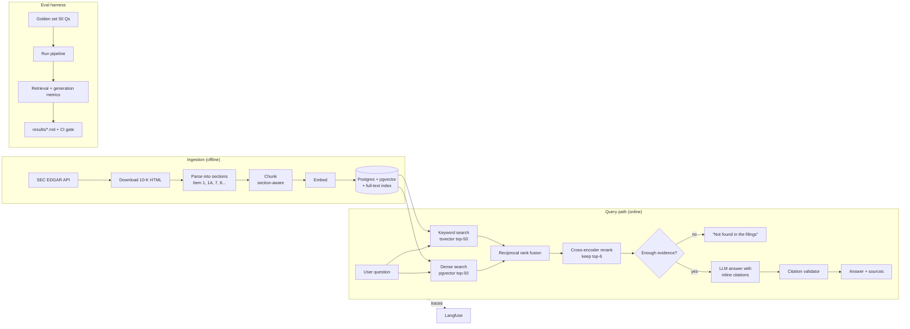
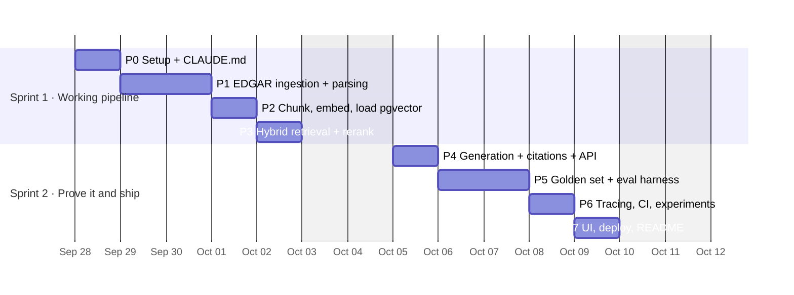

# FilingsRAG — Build Plan

A question-answering copilot over SEC 10-K filings. Every answer cites the exact passage it came from, and the system says "not found in the filings" instead of guessing. An evaluation harness measures quality, latency and cost on every change.

**Target:** 2 sprints (10 working days), built with Claude Code.
**Why this project:** in the Sep 2026 job-posting scan, RAG appeared in 70% of AI/LLM Engineer postings, observability in 41%, vector DBs in 37%, evals in 36%, Docker and CI/CD in 34%, and finance as a domain in 33%.

---

## 1. What "done" looks like

| Deliverable | Acceptance criteria |
|---|---|
| Working API | `POST /ask` returns an answer, citations (filing, section, page, chunk id) and a `grounded` flag. Streams tokens. |
| Refusal behavior | Unanswerable questions return "not found" at least 90% of the time on the golden set. |
| Eval harness | 50-question golden set; retrieval + generation metrics; one command: `make eval`. |
| CI | GitHub Actions runs unit tests + retrieval evals on every PR, and full LLM-judge evals on a label or nightly. Fails if metrics drop below thresholds. |
| Experiments | A results table comparing ≥3 retrieval configs and ≥2 models on quality, p95 latency and cost per 1K questions. |
| Observability | Every request is traced in Langfuse (retrieval hits, prompt, tokens, cost, latency). |
| Demo | A public URL with a simple UI, plus `docker compose up` for local runs. |
| README | Problem, architecture diagram, results table, quickstart in ≤3 commands, known limitations. |

---

## 2. Architecture



---

## 3. Stack and why

| Layer | Choice | Reason |
|---|---|---|
| Language / tooling | Python 3.12, `uv`, `ruff`, `pytest` | Standard for AI roles; fast setup |
| API | FastAPI + Pydantic | 58% of postings ask for API/microservice work |
| Storage | Postgres 16 + `pgvector` + built-in full-text search | One database for dense and keyword search; you already use Postgres at Saayam |
| Embeddings | Behind an interface; start with a hosted embedding API, compare to a local `sentence-transformers` model | Lets you show a cost/quality tradeoff |
| Reranker | Local cross-encoder (e.g. a BGE reranker via `sentence-transformers`) | Free, runs on CPU for top-50 |
| LLM | Behind a provider interface; Claude as default, a second provider for comparison | Claude and OpenAI each appear in ~30% of postings |
| Evals | DeepEval (pytest-native) + custom deterministic checks; Ragas optional for cross-check | Evals run like tests, easy to gate in CI |
| Tracing | Langfuse (cloud free tier or self-hosted in Docker) | Observability is in 41% of postings |
| UI | Streamlit (fast) — or React if time allows | Recruiters need something to click |
| Deploy | Docker Compose locally; Cloud Run + managed Postgres with pgvector (Neon or Supabase) | You already know GCP |
| CI | GitHub Actions | Standard |

Model names and API keys live in `.env` only, never in code.

---

## 4. Data scope

- **Companies (10):** 5 tech (Apple, Microsoft, Alphabet, Amazon, NVIDIA) and 5 financials (JPMorgan, Bank of America, Goldman Sachs, Visa, American Express).
- **Filings:** 10-K for the three most recent fiscal years → ~30 documents, roughly 20–40K chunks.
- **Source:** SEC EDGAR (`data.sec.gov` submissions JSON + filing archives). EDGAR requires a descriptive `User-Agent` header with a contact email and allows about 10 requests/second. The `edgartools` Python library is an option if raw parsing gets painful.
- Store raw HTML in `data/raw/` (gitignored) and write a manifest (`data/manifest.json`) with CIK, fiscal year, accession number and URL so ingestion is reproducible.

---

## 5. Golden set design (the part recruiters care about most)

50 questions in `evals/golden.jsonl`. Each row: `id, question, type, expected_answer, expected_sources[] (doc + section), must_refuse (bool)`.

| Type | Count | Example |
|---|---|---|
| Single fact | 15 | "What was Visa's net revenue in fiscal 2025?" |
| Numeric / table | 10 | "How much did Microsoft spend on R&D in FY2024?" |
| Risk / narrative | 8 | "What supply-chain risks does Apple list in Item 1A?" |
| Comparison / multi-hop | 7 | "Did JPMorgan or Bank of America report higher net income in 2024?" |
| Unanswerable | 10 | "What is NVIDIA's 2027 revenue guidance?" (not in a 10-K) |

Write the first 20 questions **yourself** by reading the filings; have Claude Code draft the rest and then verify every one by hand. Hand-verified labels are what make the eval credible in an interview.

### Metrics

| Stage | Metric | How |
|---|---|---|
| Retrieval | Recall@6, MRR | Deterministic: did the expected section appear in the top 6? No LLM cost. |
| Generation | Faithfulness | LLM-as-judge (DeepEval): is every claim supported by retrieved context? |
| Generation | Answer correctness | LLM-as-judge vs `expected_answer`; exact match for numbers after normalization |
| Citations | Citation precision | Deterministic: every cited chunk id exists and was retrieved |
| Refusal | Refusal accuracy | Deterministic: `must_refuse` rows return not-found; answerable rows don't |
| Ops | p50/p95 latency, cost per 1K questions | From Langfuse token counts |

**CI thresholds (start here, tighten later):** Recall@6 ≥ 0.80, faithfulness ≥ 0.85, refusal accuracy ≥ 0.90, citation precision = 1.0.

---

## 6. Repository layout

```
filings-rag/
├── CLAUDE.md
├── PLAN.md
├── README.md
├── pyproject.toml
├── Makefile                 # setup, ingest, serve, test, eval, eval-full
├── docker-compose.yml       # api, postgres(pgvector), langfuse (optional)
├── Dockerfile
├── .env.example
├── src/filings_rag/
│   ├── config.py            # pydantic-settings
│   ├── ingest/  edgar.py  parse.py  chunk.py  embed.py  load.py
│   ├── retrieve/  dense.py  keyword.py  fusion.py  rerank.py
│   ├── generate/  prompts.py  llm.py  citations.py
│   ├── pipeline.py          # ask(question, config) -> Answer
│   ├── api.py               # FastAPI app
│   └── tracing.py           # Langfuse wrapper
├── ui/app.py                # Streamlit
├── evals/
│   ├── golden.jsonl
│   ├── run_evals.py         # writes results/<run-id>.json + .md
│   ├── metrics.py
│   └── test_evals.py        # pytest gates used in CI
├── experiments/configs/*.yaml
├── results/                 # committed eval reports
├── tests/                   # unit tests
└── .github/workflows/  ci.yml  evals-full.yml
```

---

## 7. Sprint schedule



---

## 8. Phases, tasks and Claude Code prompts

**How to run each phase in Claude Code**

1. Start the phase with `/clear` so old context doesn't leak in.
2. Switch to **plan mode** (Shift+Tab) and paste the phase prompt. Read the plan it proposes and push back before approving.
3. Let it implement with tests. Commit after each task (`git commit` per task keeps diffs reviewable).
4. End every phase with the **understanding check** below. Interviewers will ask you to explain this code, so this step is not optional.

> **Understanding check (paste at the end of every phase):**
> "Explain what we built in this phase as if I'm in an interview: the design choices, one alternative we rejected and why, and the most likely failure mode. Then ask me 3 questions about the code and wait for my answers. Save a short decision record to `docs/decisions/NNN-<topic>.md`."

---

### P0 — Setup (Day 1)

Tasks: create repo, `uv init`, ruff + pytest, Makefile, docker-compose with `pgvector/pgvector:pg16`, `.env.example`, `config.py`, GitHub Actions running lint + tests.

**Prompt:**
```
Read PLAN.md and CLAUDE.md. Set up phase P0 only: uv project with Python 3.12,
ruff, pytest, pydantic-settings config loaded from .env, a Makefile with
setup/test/lint targets, docker-compose with a pgvector Postgres 16 service and a
healthcheck, and a GitHub Actions workflow that runs lint + tests. Add one smoke
test that connects to Postgres and checks the vector extension. Don't build any
RAG code yet.
```
**Done when:** `make setup && docker compose up -d db && make test` passes locally and in CI.

---

### P1 — EDGAR ingestion and parsing (Days 2–3)

Tasks: fetch submissions JSON by CIK, pick 10-K filings for the last 3 fiscal years, download the primary HTML document with polite rate limiting and caching, parse into sections (Item 1, 1A, 7, 7A, 8…), keep page/section metadata, write the manifest.

**Prompt:**
```
Implement phase P1 from PLAN.md. Build src/filings_rag/ingest/edgar.py and
parse.py. Requirements: descriptive User-Agent from config, max 8 requests/sec,
retry with backoff, on-disk cache so re-runs don't re-download. Parse each 10-K
into sections keyed by Item number, keeping section title and approximate page.
Tables should be preserved as markdown-ish text, not dropped. Write
data/manifest.json. Add unit tests using a small saved HTML fixture (no network in
tests). Add `make ingest` that runs the 10 companies in PLAN.md section 4.
Show me section counts per filing at the end.
```
**Done when:** 30 filings parsed; each has Items 1, 1A, 7 and 8 detected; tests pass offline.
**Watch for:** 10-K HTML varies a lot by company. Spot-check 3 filings by eye.

---

### P2 — Chunk, embed, load (Day 4)

Tasks: section-aware chunking (~500–800 tokens, overlap ~15%, never cross section boundaries, keep tables whole where possible); embedding interface with two implementations; schema with `chunks(id, doc_id, company, fiscal_year, section, page, text, embedding vector, tsv tsvector)`; HNSW index on embeddings and GIN index on `tsv`.

**Prompt:**
```
Implement phase P2 from PLAN.md. Chunker: section-aware, configurable size and
overlap, never crosses a section boundary, keeps markdown tables intact when they
fit. Embedding: an Embedder protocol with a hosted-API implementation and a local
sentence-transformers implementation, batched, with retries. DB: a migration that
creates the chunks table with a pgvector column, a generated tsvector column,
an HNSW index and a GIN index. Loader is idempotent (re-running doesn't duplicate).
Add `make load`. Print total chunks and estimated embedding cost at the end.
```
**Done when:** all chunks loaded; re-running `make load` changes nothing.

---

### P3 — Hybrid retrieval and reranking (Day 5)

Tasks: dense search (top-50), keyword search with `websearch_to_tsquery` + `ts_rank_cd` (top-50), reciprocal rank fusion, cross-encoder rerank to top-6, metadata filters (company, fiscal year) extracted from the question when present.

**Prompt:**
```
Implement phase P3 from PLAN.md: dense.py, keyword.py, fusion.py (reciprocal rank
fusion, k=60), rerank.py (local cross-encoder, top-50 in, top-6 out). Retrieval
mode must be configurable: dense | keyword | hybrid | hybrid_rerank, so we can
compare them later. Add simple company/year filter extraction from the question.
Add a CLI: `python -m filings_rag.retrieve "question" --mode hybrid_rerank` that
prints the top results with scores and section labels. Unit-test fusion with
hand-made rankings.
```
**Done when:** for 5 test questions you pick, the right section shows up in the top 6 in `hybrid_rerank` mode.

---

### P4 — Generation, citations and API (Day 6)

Tasks: prompt that requires inline citations like `[c:123]` and allows only retrieved chunks; evidence gate (if the top rerank score is below a threshold → not found); citation validator that strips or flags unknown ids; `pipeline.ask()`; FastAPI `/ask` (streaming) and `/health`.

**Prompt:**
```
Implement phase P4 from PLAN.md. The system prompt must: answer only from the
provided chunks, cite every claim with [c:<chunk_id>], and reply exactly
"Not found in the filings." when evidence is missing. Add an evidence gate on the
top rerank score (threshold in config). Add citations.py that validates every
cited id was in the retrieved set and returns structured sources. LLM access goes
through an LLMProvider protocol with two providers. Build FastAPI POST /ask
(supports streaming) returning {answer, sources[], grounded, latency_ms,
tokens, cost_usd}. Tests mock the LLM.
```
**Done when:** `curl` to `/ask` returns a cited answer, and an off-topic question returns not-found.

---

### P5 — Golden set and eval harness (Days 7–8)

Tasks: write 20 questions yourself; draft 30 more with Claude Code and verify each by hand; `run_evals.py` runs any experiment config and writes `results/<run-id>.json` and a markdown summary; deterministic metrics in `metrics.py`; DeepEval faithfulness + correctness; `test_evals.py` with thresholds.

**Prompt:**
```
Implement phase P5 from PLAN.md. I've written evals/golden.jsonl rows 1–20 by
hand. Draft 30 more following the type mix in section 5, reading the actual
parsed filings so expected answers and sources are real — mark them
"verified": false so I can check each one. Then build evals/run_evals.py
(takes an experiment YAML, runs the pipeline over the golden set with
concurrency limits, caches LLM calls by hash) and metrics.py (Recall@6, MRR,
citation precision, refusal accuracy, p50/p95 latency, cost per 1K). Add
DeepEval faithfulness and answer correctness. Write results as JSON and a
markdown table. Add evals/test_evals.py with the thresholds in section 5 and
`make eval` (retrieval-only, no LLM judge) and `make eval-full`.
```
**Done when:** `make eval-full` prints a results table, and you have personally verified all 50 rows.

---

### P6 — Tracing, CI gates and experiments (Day 9)

Tasks: Langfuse traces per request (spans for dense, keyword, rerank, LLM); CI runs `make eval` on every PR and posts the table as a PR comment; `evals-full.yml` runs on a `run-full-evals` label and nightly; run the experiment grid.

**Experiment grid:**

| Run | Chunking | Retrieval | Model |
|---|---|---|---|
| A | fixed 512 | dense | default |
| B | section-aware | dense | default |
| C | section-aware | hybrid | default |
| D | section-aware | hybrid + rerank | default |
| E | section-aware | hybrid + rerank | second provider / cheaper model |

**Prompt:**
```
Implement phase P6 from PLAN.md. Add Langfuse tracing in tracing.py with spans
for each retrieval stage and the LLM call, including tokens and cost. Update CI:
on every PR run unit tests and `make eval`, then post results/*.md as a PR
comment; add evals-full.yml triggered by the label run-full-evals and a nightly
schedule, using repository secrets for API keys. Create experiments/configs A–E
from the grid in PLAN.md, run them, and generate results/comparison.md with one
row per run: Recall@6, MRR, faithfulness, correctness, refusal accuracy, p95
latency, cost per 1K questions.
```
**Done when:** a PR shows the eval table as a comment, and `results/comparison.md` exists with real numbers.

---

### P7 — UI, deployment and README (Day 10)

Tasks: Streamlit UI (question box, answer with clickable citations, "sources" panel showing the exact passage, company/year filters); Dockerfile; deploy API + UI to Cloud Run with managed Postgres; README.

**Prompt:**
```
Implement phase P7 from PLAN.md. Build ui/app.py in Streamlit: question input,
streamed answer, citations that expand to show the exact passage with company,
year and section, and optional company/year filters. Write a production
Dockerfile (multi-stage, non-root). Add deployment notes for Cloud Run with a
managed Postgres that supports pgvector. Then write README.md with: problem
statement, architecture diagram (Mermaid), results table from
results/comparison.md, quickstart in ≤3 commands, eval methodology, known
limitations, and next steps.
```
**Done when:** a stranger can open the live URL and ask a question, and the README results table matches the latest eval run.

---

## 9. Claude Code setup tips

- **`CLAUDE.md`** (included) keeps conventions consistent across sessions.
- **Custom command:** create `.claude/commands/eval.md` with "Run `make eval`, summarize regressions against the last committed results in `results/`, and propose one fix." Then `/eval` works in every session.
- **Review subagent:** before merging each phase, ask Claude Code to "use a subagent to review this diff for bugs, missing tests and secrets" so the code isn't only reviewed by the session that wrote it.
- **Hooks (optional):** a post-edit hook that runs `ruff format` keeps diffs clean.
- **Cost control:** cache LLM calls in evals by input hash; run the full LLM-judge suite only on label or nightly.
- **Keep context small:** one phase per session; `/compact` if a session runs long.

---

## 10. Risks and mitigations

| Risk | Mitigation |
|---|---|
| 10-K HTML parsing is messy | Start with 3 companies, spot-check, then scale; fall back to `edgartools` |
| Numbers in tables retrieved badly | Keep tables intact in chunks; add numeric questions to the golden set to measure it |
| LLM-judge scores are noisy | Pair every judge metric with a deterministic one; fix the judge model and temperature 0 |
| API costs creep up | Eval caching, cheap model for drafts, full evals only on demand |
| Scope creep | Anything not in section 1 goes to "Next steps" in the README |

---

## 11. Interview talking points to capture as you go

Keep `docs/notes.md` updated with real numbers from your runs:

- How much hybrid search and reranking improved Recall@6 over dense-only (runs B → D).
- Why section-aware chunking beat fixed-size chunks, or why it didn't.
- How the evidence gate traded answer rate for refusal accuracy, and how you chose the threshold.
- Cost per 1K questions for the default model vs the cheaper one, and whether the quality drop was acceptable.
- One failure you found through evals and how you fixed it.
