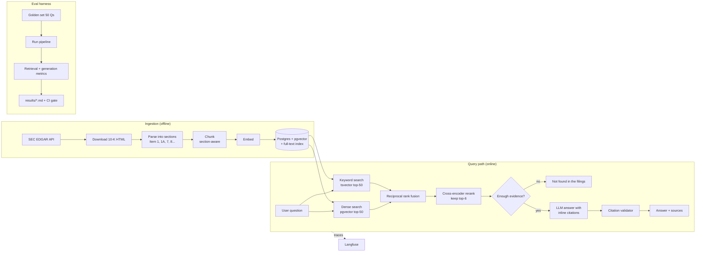
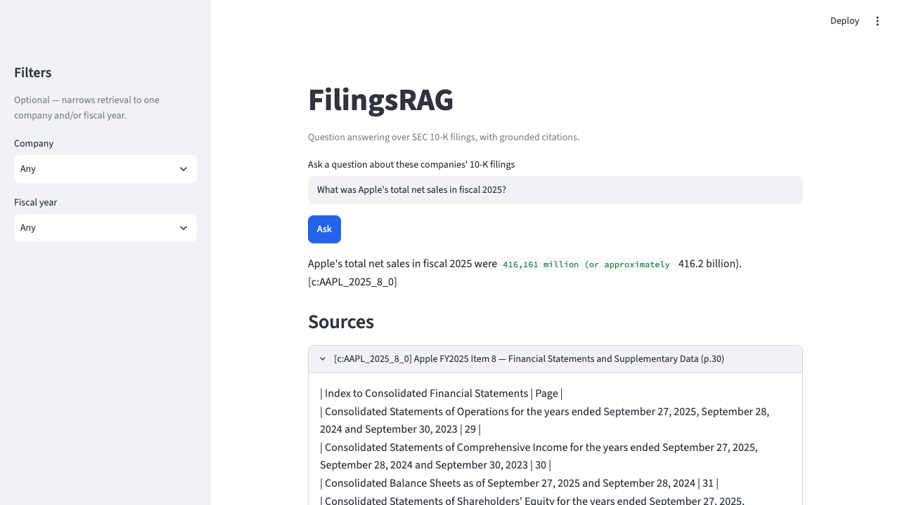
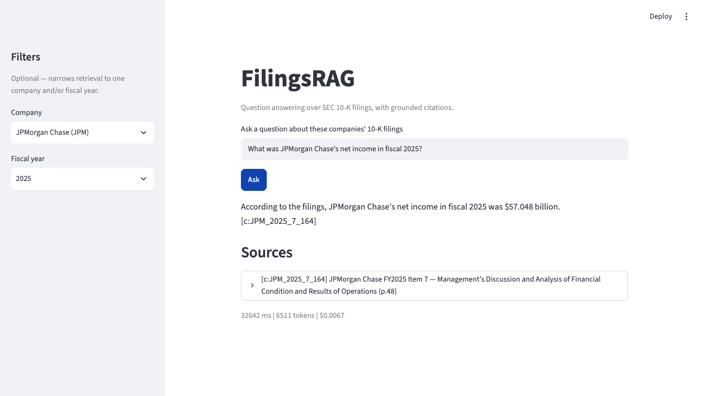
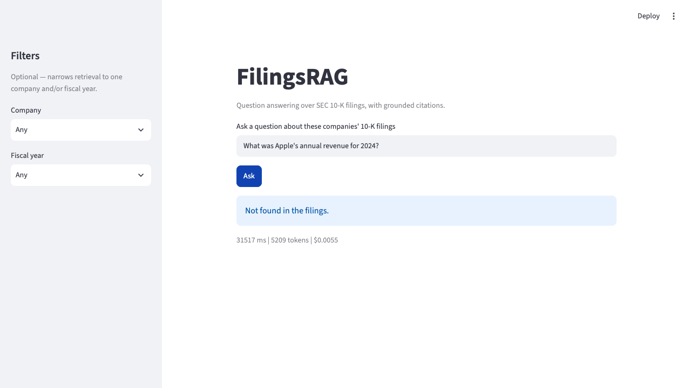

# FilingsRAG

Question answering over SEC 10-K filings, with grounded citations and an evaluation harness. Every answer cites the exact chunk it came from; an unanswerable question gets exactly `"Not found in the filings."` instead of a guess.

**Live demo:** _add your deployed Streamlit URL here after following [docs/deployment.md](docs/deployment.md)._

## Problem

Reading a 10-K to answer a specific question (revenue, R&D spend, a risk factor) means searching a 100+ page document by hand, or trusting an LLM's memory of the filing -- which hallucinates numbers with total confidence. FilingsRAG retrieves the actual passage before answering, cites the chunk id, and refuses rather than guess when retrieval comes up short.

## Architecture



## Screenshots

Real questions against the real running system (Streamlit UI, FastAPI backend, loaded Postgres), not mockups.

**A grounded answer, citation expanded to the exact retrieved passage:**



**The company/year filters narrowing retrieval before the LLM ever sees the question:**



**A refusal -- the right section was retrieved, but not the specific chunk with the actual figure, so the model correctly declined rather than guess (see "Known limitations" below):**



## Quickstart (3 commands)

Seeds a small real fixture (89 already-embedded chunks from Apple and JPMorgan filings -- the same one CI uses) instead of running the full paid ingest pipeline, so no re-embedding of a whole corpus is needed:

```bash
docker compose up -d db
make setup && uv run python -m filings_rag.seed_eval_fixture
make serve
```

Asking a real question still needs two API keys in `.env` -- a Voyage key (embeds your question; a fraction of a cent) and one LLM provider key (`ANTHROPIC_API_KEY`, `OPENAI_API_KEY`, or `OPENROUTER_API_KEY` matching `LLM_PROVIDER`). The fixture only removes the cost of embedding the *corpus*, not the two calls a single question still makes. Then, in another terminal:

```bash
curl -X POST localhost:8000/ask -H "Content-Type: application/json" \
  -d '{"question": "What was Apple'"'"'s total net sales in fiscal 2025?"}'
```

For the full 10-company corpus and the Streamlit UI, see "Full local setup" below.

## Full local setup

```bash
docker compose up -d db
make setup
make migrate
make ingest   # needs SEC_USER_AGENT in .env; downloads real filings, no cost
make load     # needs VOYAGE_API_KEY; real embedding cost, ~$0.50-1 for all 10 companies
make serve    # API at localhost:8000
uv run streamlit run ui/app.py   # UI at localhost:8501, in another terminal
```

## Eval methodology

- **`make eval`** -- Recall@6 and MRR against a 50-question, hand-verified golden set (`evals/golden.jsonl`), retrieval only, no LLM call. Runs on every PR against a small committed fixture (`make eval-ci`), free.
- **`make eval-full`** -- the real pipeline plus DeepEval LLM-judge scoring (faithfulness, correctness), against a different model (Claude Sonnet 5 direct) than whichever generated the answers, to avoid a model favoring its own output. Costs money; gated behind a PR label or nightly schedule, never every push.
- **`make comparison`** -- runs PLAN.md's 5-config experiment grid (chunking strategy x retrieval mode x model) and writes the table below.

### Experiment grid results

| Run | Chunking | Retrieval | Model | Judged | Recall@6 | MRR | Faithfulness | Correctness | Refusal acc. | p95 latency (ms) | Generation cost/1K |
|---|---|---|---|---|---|---|---|---|---|---|---|
| A | fixed-512 | dense | claude-haiku-4.5 | yes | 0.838 | 0.632 | 0.800 | 0.733 | 0.840 | 4096 | $4.02 |
| B | section-aware | dense | claude-haiku-4.5 | yes | 0.787 | 0.602 | 0.850 | 0.760 | 0.860 | 5509 | $5.37 |
| C | section-aware | hybrid | claude-haiku-4.5 | yes | 0.787 | 0.572 | 0.850 | 0.745 | 0.860 | 3426 | $5.44 |
| D | section-aware | hybrid+rerank | claude-haiku-4.5 | no | 0.850 | 0.619 | n/a | n/a | 0.760 | 9211 | $5.48 |
| E | section-aware | hybrid+rerank | gpt-4o-mini | no | 0.850 | 0.619 | n/a | n/a | 0.780 | 16565 | $0.69 |

Section-aware chunking beats fixed-512 windows on refusal accuracy at equal recall (B vs. A); reranking gives the best Recall@6/MRR of any config but the worst refusal accuracy, because it also improves comparison-question retrieval enough to tempt an answer where a single-shot retrieval would have safely refused. Full detail in [results/comparison.md](results/comparison.md) and [docs/decisions/007](docs/decisions/007-tracing-ci-and-experiment-grid.md).

## Known limitations

- **Refusal accuracy (0.763) and faithfulness (0.714) fail their PLAN.md thresholds (0.90, 0.85) on the full golden set**, and this is not glossed over -- see [docs/decisions/006](docs/decisions/006-golden-set-and-eval-harness.md) for the full diagnosis. In short: comparison-type questions correctly refuse when a single retrieval pass only surfaces one of two companies' data (safe behavior, but the golden set expects an answer); and the golden set's doc+section-level ground truth can't tell "right section, wrong chunk" apart from a real hit.
- **12 of 50 rows still fail LLM-judge scoring** on unusually large retrieved contexts, even after raising `judge_max_tokens` to 8192 -- the correct fix is capping context sent to the judge, not raising the ceiling further; not yet built.
- **The judge is expensive.** DeepEval's `FaithfulnessMetric` makes several LLM calls per question internally; a full judged run of all 50 questions costs roughly $3-5, not the few cents a single generation call would suggest.
- **Fixed-512 chunking (experiment A) still respects Item/section boundaries** rather than chunking across them -- PLAN.md's grid names it "fixed 512" without specifying this; see [docs/decisions/007](docs/decisions/007-tracing-ci-and-experiment-grid.md) for the reasoning.

## Next steps

- Cap/summarize context sent to the LLM judge (fixes the remaining 12/50 truncation errors and lowers judge cost).
- Multi-query retrieval for comparison-type questions (decompose into per-entity sub-queries) to close the refusal-accuracy gap without giving up hybrid+rerank's recall advantage.
- Chunk-level (not just section-level) `expected_sources` in the golden set, for a tighter Recall@6 measurement.
- Provision a persistent, GitHub-Actions-reachable database and add the secrets `evals-full.yml` needs, if nightly full evals become worth the recurring cost.

## Stack

Python 3.12 - uv - FastAPI - Pydantic v2 - Postgres 16 + pgvector + full-text search - sentence-transformers (reranker, local embeddings) - DeepEval - Langfuse - Streamlit - Docker Compose - GitHub Actions.

Full build plan and per-phase design decisions in [PLAN.md](PLAN.md) and [docs/decisions/](docs/decisions/).

## License

[MIT](LICENSE)
